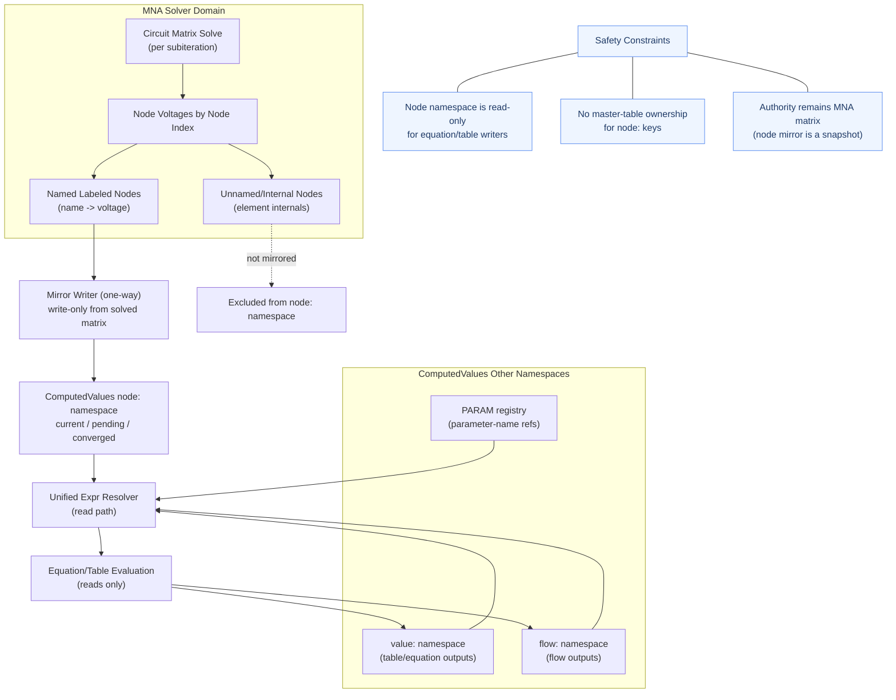
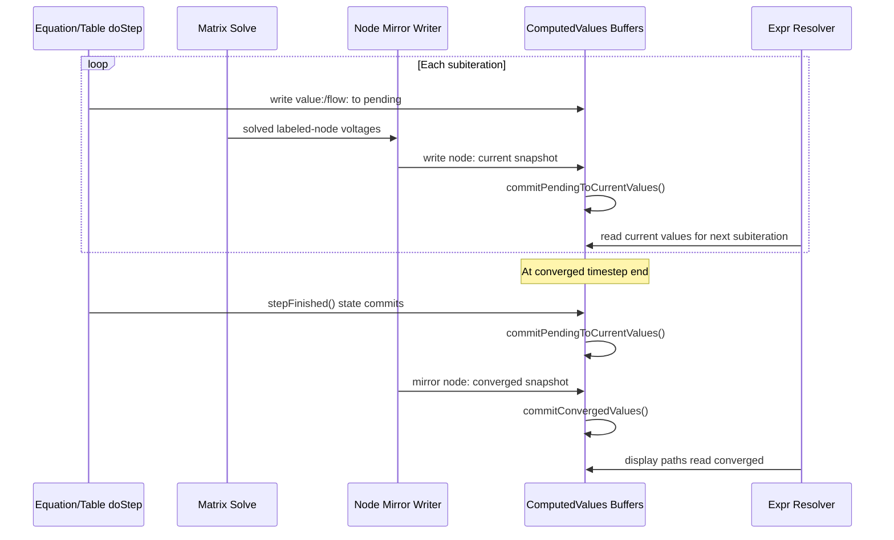

## Plan: Unified Equation Runtime Phases 2A-5 (DRAFT)

This plan uses your decisions: include all table-family elements, keep matrix voltage authoritative in MNA mode, and mirror labeled nodes each subiteration. The approach is to first make ComputedValues the single read surface for expressions while preserving MNA correctness, then progressively optimize lookup cost and evaluation scope. Sequencing is 2A → 2 → 3 → 4 → 5 so each phase builds on stable semantics from the prior one and avoids rework.

**Steps**
1. Phase 2A foundation: add explicit node-mirror namespace in [src/com/lushprojects/circuitjs1/client/ComputedValues.java](src/com/lushprojects/circuitjs1/client/ComputedValues.java) for mirrored labeled-node voltages, including current/pending/converged accessors and collision-safe naming.
2. Phase 2A timing integration: mirror all labeled-node values in the simulation loop at deterministic points in [src/com/lushprojects/circuitjs1/client/CirSim.java](src/com/lushprojects/circuitjs1/client/CirSim.java), aligned with existing doStep/commit/stepFinished lifecycle.
3. Phase 2A lookup unification: move E_NODE_REF resolution to one registry-first resolver in [src/com/lushprojects/circuitjs1/client/Expr.java](src/com/lushprojects/circuitjs1/client/Expr.java), preserving existing precedence semantics (PARAM, flow, node, fallback) and unresolved-reference behavior.
4. Phase 2A table-family adoption: verify all table-family paths read through unified resolver in [src/com/lushprojects/circuitjs1/client/TableEquationManager.java](src/com/lushprojects/circuitjs1/client/TableEquationManager.java), [src/com/lushprojects/circuitjs1/client/TableElm.java](src/com/lushprojects/circuitjs1/client/TableElm.java), [src/com/lushprojects/circuitjs1/client/SFCTableElm.java](src/com/lushprojects/circuitjs1/client/SFCTableElm.java), and [src/com/lushprojects/circuitjs1/client/EquationTableElm.java](src/com/lushprojects/circuitjs1/client/EquationTableElm.java).

**Phase 2A Safety Constraints (No Circularity)**
- One-way mirror rule: node-mirror keys are written only from solved matrix/labeled-node values in [src/com/lushprojects/circuitjs1/client/CirSim.java](src/com/lushprojects/circuitjs1/client/CirSim.java), never from table/equation outputs.
- Namespace isolation: mirrored node values use dedicated node namespace (for example, `node:Name`) separate from value and flow namespaces to prevent key aliasing.
- Read-only node mirror contract: only the mirror integration path can write node namespace keys; expression/table writers cannot write to node namespace.
- No master registration for node mirrors: node namespace keys are excluded from master-table arbitration in [src/com/lushprojects/circuitjs1/client/ComputedValues.java](src/com/lushprojects/circuitjs1/client/ComputedValues.java).
- Precedence preservation: in MNA mode, behavior remains logically equivalent to today’s PARAM/flow/node/fallback ordering in [src/com/lushprojects/circuitjs1/client/Expr.java](src/com/lushprojects/circuitjs1/client/Expr.java).
- Timing guardrail: mirror current values after each matrix solve and mirror converged values at timestep commit to avoid stale/self-feedback artifacts.

**Phase 2A Runtime Flow**

**Phase 2A Runtime Mapping to Current Code**
- Subiteration write phase: Equation/Table elements write `value:` and `flow:` outputs to pending buffer during `doStep()` in [src/com/lushprojects/circuitjs1/client/EquationTableElm.java](src/com/lushprojects/circuitjs1/client/EquationTableElm.java) and table-family evaluators.
- Subiteration solve phase: matrix solve updates physical node voltages in [src/com/lushprojects/circuitjs1/client/CirSim.java](src/com/lushprojects/circuitjs1/client/CirSim.java).
- Subiteration mirror point: after each solve, mirror named labeled-node voltages into `node:` current snapshot in [src/com/lushprojects/circuitjs1/client/ComputedValues.java](src/com/lushprojects/circuitjs1/client/ComputedValues.java).
- Subiteration visibility barrier: commit pending to current via `commitPendingToCurrentValues()` in [src/com/lushprojects/circuitjs1/client/ComputedValues.java](src/com/lushprojects/circuitjs1/client/ComputedValues.java).
- End-of-timestep state commit: `stepFinished()` commits stateful expression functions (`integrate`/`diff`/`lag`/`smooth`) in [src/com/lushprojects/circuitjs1/client/Expr.java](src/com/lushprojects/circuitjs1/client/Expr.java) and callers.
- End-of-timestep converged mirror: mirror labeled-node voltages into `node:` converged snapshot, then call `commitConvergedValues()` in [src/com/lushprojects/circuitjs1/client/ComputedValues.java](src/com/lushprojects/circuitjs1/client/ComputedValues.java).
- Display read path: display-only evaluations read converged values through unified resolver in [src/com/lushprojects/circuitjs1/client/Expr.java](src/com/lushprojects/circuitjs1/client/Expr.java) and [src/com/lushprojects/circuitjs1/client/TableEquationManager.java](src/com/lushprojects/circuitjs1/client/TableEquationManager.java).

**Phase 2A Acceptance Criteria**
- `Expr.E_NODE_REF` reads through unified ComputedValues resolver path for table-family evaluations, with no direct labeled-node lookup branch left in the hot path.
- Node namespace keys cannot be written by Equation/Table writers; attempted writes are blocked or logged as invariant violations.
- Node namespace keys are absent from master-table registration and master-table debug dumps.
- For a same-name PARAM and labeled node in MNA mode, observed result matches legacy precedence behavior.
- For a same-name FLOW and labeled node in MNA mode, observed result matches legacy flow-preferred behavior where applicable.
- Unresolved reference list contents and warning behavior remain unchanged for existing benchmark circuits.
- Economic replay circuit [src/com/lushprojects/circuitjs1/public/circuits/economics/1debug.txt](src/com/lushprojects/circuitjs1/public/circuits/economics/1debug.txt) preserves convergence behavior and key variable trajectories within expected numerical tolerance.
- Display-only consumers using converged values remain stable across subiterations (no flicker/regression).
- No new matrix-authority regressions: changing matrix-solved labeled-node voltage is reflected in node mirrors on the same subiteration cycle.

5. Phase 2 prebinding model: extend parsed expression nodes in [src/com/lushprojects/circuitjs1/client/Expr.java](src/com/lushprojects/circuitjs1/client/Expr.java) with a bound-reference descriptor (kind + token + invalidation generation) while keeping name fallback for compatibility.
6. Phase 2 bind lifecycle: add bind/refresh hooks after analysis and label coordination so bindings update when names/nodes change, using integration points in [src/com/lushprojects/circuitjs1/client/CirSim.java](src/com/lushprojects/circuitjs1/client/CirSim.java) and table parse/recompile flows in [src/com/lushprojects/circuitjs1/client/EquationTableElm.java](src/com/lushprojects/circuitjs1/client/EquationTableElm.java).
7. Phase 3 ID store introduction: implement dual-path registry in [src/com/lushprojects/circuitjs1/client/ComputedValues.java](src/com/lushprojects/circuitjs1/client/ComputedValues.java) with name-to-id map plus dense id-value arrays for current/pending/converged.
8. Phase 3 read-path migration: route hot reads in E_NODE_REF to id-based access first, retaining string accessors for backward compatibility and external tooling/debug APIs.
9. Phase 3 write-path migration: update table-family writers and mirror writers to use id registration/cache, with strict parity checks against legacy string path during transition.
10. Phase 4 dependency graph: build per-table expression dependency extraction and graph construction in [src/com/lushprojects/circuitjs1/client/EquationTableElm.java](src/com/lushprojects/circuitjs1/client/EquationTableElm.java), then run SCC ordering for incremental row evaluation.
11. Phase 4 scheduler policy: evaluate only dirty SCCs each subiteration, force full-eval fallback for rows using stateful functions (integrate/diff/lag/smooth) and preserve global convergence safeguards.
12. Phase 5 cleanup/perf hardening: remove deprecated resolution branches, tighten profiling reports in [src/com/lushprojects/circuitjs1/client/Expr.java](src/com/lushprojects/circuitjs1/client/Expr.java), and document final lookup/runtime model in [dev_docs/ARCHITECTURE.md](dev_docs/ARCHITECTURE.md).

**Verification**
- Functional regression: run existing equation/table tests, including [src/com/lushprojects/circuitjs1/client/MathElementsTest.java](src/com/lushprojects/circuitjs1/client/MathElementsTest.java) and [src/com/lushprojects/circuitjs1/client/TableElementsTest.java](src/com/lushprojects/circuitjs1/client/TableElementsTest.java).
- Economic scenario replay: load [src/com/lushprojects/circuitjs1/public/circuits/economics/1debug.txt](src/com/lushprojects/circuitjs1/public/circuits/economics/1debug.txt) and compare key variables/subiteration counts before vs after each phase.
- Runtime parity gates per phase: confirm unresolved-reference list, PARAM precedence, flow key behavior, and converged display stability remain unchanged.
- Performance gates: compare Expr node-ref average timing and total subiterations pre/post phase using existing probe hooks.

**Decisions**
- Scope: all table-family elements in this migration wave.
- Truth model: matrix voltage remains authoritative in MNA mode; registry mirrors it.
- Mirror strategy: mirror labeled nodes each subiteration (optimize later if needed).
- Delivery sequence: 2A first for semantic unification, then 2/3 for speed, then 4 for incremental scheduling, then 5 cleanup.
