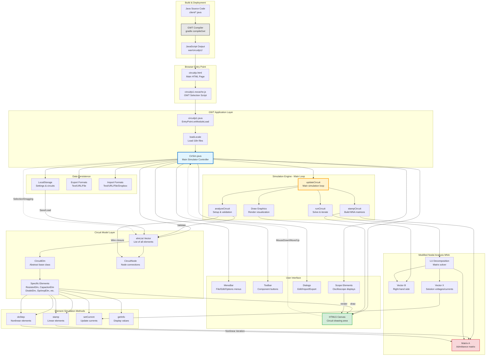

# CircuitJS1 Architecture

## Overview

CircuitJS1 is a client-side electronic circuit simulator that runs entirely in web browsers. It's built using Java that compiles to JavaScript via Google Web Toolkit (GWT). The simulator uses Modified Nodal Analysis (MNA) to solve circuit equations in real-time.

## Architecture Diagram



## Key Components

### 1. Application Entry Point

**File**: `src/com/lushprojects/circuitjs1/client/circuitjs1.java`

- **Entry Point**: `onModuleLoad()` - Called automatically by GWT
- **Localization**: Loads language files from `war/circuitjs1/locale_*.txt`
- **Initialization**: Creates `CirSim` instance and calls `init()`

### 2. Main Simulator (CirSim)

**File**: `src/com/lushprojects/circuitjs1/client/CirSim.java`

The central controller class that manages:
- UI components (menus, toolbar, canvas)
- Circuit model (`elmList` vector of elements)
- Simulation loop
- User interactions (mouse, keyboard)
- File import/export
- Settings persistence

### 3. Circuit Elements

**Base Class**: `CircuitElm.java`

All circuit components extend this abstract class and implement:

#### Required Methods:
- `getDumpType()` - Unique identifier for serialization
- `getPostCount()` - Number of terminals/connections
- `setPoints()` - Calculate geometry
- `draw()` - Render to canvas
- `stamp()` - Stamp linear equations (called once)
- `doStep()` - Stamp nonlinear equations (called each iteration)
- `getInfo()` - Return info for display

#### Element Examples:
- **Linear**: `ResistorElm`, `CapacitorElm`, `InductorElm`
- **Nonlinear**: `DiodeElm`, `TransistorElm`, `OpAmpElm`
- **Sources**: `VoltageElm`, `CurrentElm`
- **Logic**: `AndGateElm`, `NandGateElm`, etc.
- **Visualization**: `ScopeElm`, `ProbeElm`

### 4. Simulation Engine - The Main Loop

**Method**: `updateCircuit()` in `CirSim.java`

```
Loop continuously:
  1. analyzeCircuit()    - Setup and validation
  2. stampCircuit()      - Build MNA matrices  
  3. runCircuit()        - Solve equations
  4. drawCircuit()       - Render visualization
```

#### Phase 1: Analysis (`analyzeCircuit()`)
- Calculate wire closure (which nodes are connected)
- Set ground node reference
- Detect unconnected nodes
- Validate circuit structure
- Allocate matrices

#### Phase 2: Stamping (`stampCircuit()`)
- Connect isolated nodes to ground via large resistors
- Matrix simplification for performance
- Call `stamp()` on linear elements (once)
- Perform LU factorization for linear circuits

#### Phase 3: Simulation (`runCircuit()`)
- **Outer Loop**: Full simulation timesteps
- **Inner Loop**: Convergence iterations for nonlinear elements
  - Call `doStep()` on nonlinear elements
  - Solve matrix: **X = A⁻¹B** via `lu_solve()`
  - Update node voltages and branch currents
  - Check convergence
- Update element states

#### Phase 4: Drawing (`drawCircuit()`)
- Render each element via `draw()`
- Draw current flow dots
- Render scopes
- Update info displays

### 5. Modified Nodal Analysis (MNA)

Based on "Electronic Circuit and System Simulation Methods" (Pillage, Rohrer, & Visweswariah, 1999)

**Core Equation**: **X = A⁻¹B**

Where:
- **A**: Square admittance matrix (one row per node + voltage sources)
- **B**: Right-hand side vector (current sources, voltage sources)
- **X**: Solution vector (node voltages, branch currents)

#### Matrix Stamping Patterns:

**Resistor** (conductance G = 1/R):
```
Node1: A[n1][n1] += G,  A[n1][n2] -= G
Node2: A[n2][n1] -= G,  A[n2][n2] += G
```

**Current Source** (current I):
```
B[n1] -= I
B[n2] += I
```

**Voltage Source** (voltage V):
```
Adds extra row and column to matrix
A[n1][vsIdx] = 1,  A[n2][vsIdx] = -1
A[vsIdx][n1] = 1,  A[vsIdx][n2] = -1
B[vsIdx] = V
```

**Nonlinear Elements** (diodes, transistors):
- Linearized each iteration using companion models
- Represented as resistor + current source
- Iteratively updated until convergence

### 6. User Interface

**Canvas**: HTML5 Canvas element for drawing
- Mouse handlers: drag, select, add components
- Keyboard shortcuts for commands
- Context menus for element editing

**Menus** (GWT MenuBar):
- File: Import/Export circuits
- Edit: Cut/Copy/Paste
- Draw: Add components
- Scopes: Configure oscilloscopes
- Options: Settings

**Toolbar**: Quick access to common components

**Dialogs**: Edit element properties, settings

### 7. Data Persistence

**LocalStorage**: Browser storage for:
- Circuit text (serialized)
- User settings
- Component preferences

**Export Formats**:
- Text (circuit definition)
- URL (compressed circuit in query string)
- Local file download
- Dropbox (with API key)

**Import Sources**:
- Text paste
- URL parameter (`?cct=...` or `?ctz=...`)
- Local file upload
- Dropbox picker
- Built-in example circuits

### 8. Build Process

**Source**: Java files in `src/com/lushprojects/circuitjs1/client/`

**Compilation**:
```bash
gradle compileGwt
# or
./dev.sh compile
```

**Output**: JavaScript in `war/circuitjs1/`

**GWT Compilation**:
1. Java → JavaScript transpilation
2. Optimization and obfuscation
3. Code splitting
4. Permutation generation (browser-specific)

**Deployment**: Copy `war/` contents (except `WEB-INF/`) to web server

## Project Structure

```
src/com/lushprojects/circuitjs1/client/
├── circuitjs1.java              # GWT EntryPoint
├── CirSim.java                  # Main simulator
├── CircuitElm.java              # Element base class
├── [Component]Elm.java          # Element implementations
├── Scope.java                   # Oscilloscope
├── Graphics.java                # Canvas wrapper
└── util/
    └── Locale.java              # Internationalization

war/
├── circuitjs.html               # Main HTML page
├── circuitjs1/                  # GWT compiled output
│   ├── circuitjs1.nocache.js   # GWT loader
│   ├── *.cache.html            # Compiled permutations
│   ├── circuits/               # Example circuits
│   ├── setuplist.txt           # Circuit index
│   └── locale_*.txt            # Translation files
└── iframe.html                  # Branding frame

build.gradle                     # Gradle build config
```

## Technology Stack

- **Language**: Java 8 (client-side only)
- **Framework**: Google Web Toolkit (GWT) 2.8.2
- **Build**: Gradle + Ant (legacy)
- **Graphics**: HTML5 Canvas API
- **Storage**: Browser LocalStorage
- **Target**: Modern web browsers

## Performance Considerations

- **Matrix Complexity**: O(n³) for LU decomposition
- **Optimization**: Matrix simplification removes trivial rows
- **Timestep**: Adaptive based on simulation speed setting
- **Rendering**: Optimized drawing with current dots animation
- **Convergence**: Iterative solving for nonlinear elements

## Key Characteristics

✅ **Fully Client-Side**: All simulation runs in browser  
✅ **No Server Required**: Static file hosting sufficient  
✅ **Real-Time**: Interactive circuit editing and simulation  
✅ **Educational**: Visual feedback and oscilloscope views  
✅ **Portable**: Works across desktop and mobile browsers  
✅ **Open Source**: GPL v2 licensed

## References

- [INTERNALS.md](INTERNALS.md) - Detailed simulation theory
- [CircuitJS1 Original](https://www.falstad.com/circuit/) - Paul Falstad's original
- GWT Documentation: https://www.gwtproject.org/
- Modified Nodal Analysis: Pillage et al. (1999)
