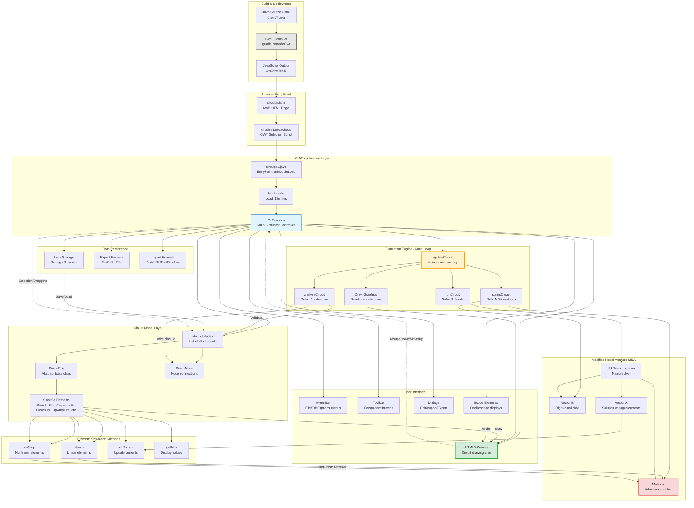

# CircuitJS1 Architecture

## Overview

CircuitJS1 is a client-side electronic circuit simulator that runs entirely in web browsers. It's built using Java that compiles to JavaScript via Google Web Toolkit (GWT). The simulator uses Modified Nodal Analysis (MNA) to solve circuit equations in real-time.

## Architecture Diagram



## Key Components

### 1. Application Entry Point

**File**: `src/com/lushprojects/circuitjs1/client/circuitjs1.java`

- **Entry Point**: `onModuleLoad()` - Called automatically by GWT
- **Localization**: Loads language files from `war/circuitjs1/locale_*.txt`
- **Initialization**: Creates `CirSim` instance and calls `init()`

### 2. Main Simulator (CirSim)

**File**: `src/com/lushprojects/circuitjs1/client/CirSim.java`

The central controller class that manages:
- UI components (menus, toolbar, canvas)
- Circuit model (`elmList` vector of elements)
- Simulation loop
- User interactions (mouse, keyboard)
- File import/export
- Settings persistence

### 3. Circuit Elements

**Base Class**: `CircuitElm.java`

All circuit components extend this abstract class and implement:

#### Required Methods:
- `getDumpType()` - Unique identifier for serialization
- `getPostCount()` - Number of terminals/connections
- `setPoints()` - Calculate geometry
- `draw()` - Render to canvas
- `stamp()` - Stamp linear equations (called once)
- `doStep()` - Stamp nonlinear equations (called each iteration)
- `getInfo()` - Return info for display

#### Element Examples:
- **Linear**: `ResistorElm`, `CapacitorElm`, `InductorElm`
- **Nonlinear**: `DiodeElm`, `TransistorElm`, `OpAmpElm`
- **Sources**: `VoltageElm`, `CurrentElm`
- **Logic**: `AndGateElm`, `NandGateElm`, etc.
- **Visualization**: `ScopeElm`, `ProbeElm`

### 4. Simulation Engine - The Main Loop

**Method**: `updateCircuit()` in `CirSim.java`

```
Loop continuously:
  1. analyzeCircuit()    - Setup and validation
  2. stampCircuit()      - Build MNA matrices  
  3. runCircuit()        - Solve equations
  4. Draw graphics       - Render visualization (inline)
```

#### Phase 1: Analysis (`analyzeCircuit()`)
- Calculate wire closure (which nodes are connected)
- Set ground node reference
- Detect unconnected nodes
- Validate circuit structure
- Allocate matrices

#### Phase 2: Stamping (`stampCircuit()`)
- Connect isolated nodes to ground via large resistors
- Matrix simplification for performance
- Call `stamp()` on linear elements (once)
- Perform LU factorization for linear circuits

#### Phase 3: Simulation (`runCircuit()`)
- **Outer Loop**: Full simulation timesteps
- **Inner Loop**: Convergence iterations for nonlinear elements
  - Call `doStep()` on nonlinear elements
  - Solve matrix: **X = A⁻¹B** via `lu_solve()`
  - Update node voltages and branch currents
  - Check convergence
- Update element states

#### Phase 4: Drawing (inline in `updateCircuit()`)
- Render each element via `draw()`
- Draw current flow dots
- Render scopes
- Update info displays

### 5. Modified Nodal Analysis (MNA)

Based on "Electronic Circuit and System Simulation Methods" (Pillage, Rohrer, & Visweswariah, 1999)

**Core Equation**: **X = A⁻¹B**

Where:
- **A**: Square admittance matrix (one row per node + voltage sources)
- **B**: Right-hand side vector (current sources, voltage sources)
- **X**: Solution vector (node voltages, branch currents)

#### Matrix Stamping Patterns:

**Resistor** (conductance G = 1/R):
```
Node1: A[n1][n1] += G,  A[n1][n2] -= G
Node2: A[n2][n1] -= G,  A[n2][n2] += G
```

**Current Source** (current I):
```
B[n1] -= I
B[n2] += I
```

**Voltage Source** (voltage V):
```
Adds extra row and column to matrix
A[n1][vsIdx] = 1,  A[n2][vsIdx] = -1
A[vsIdx][n1] = 1,  A[vsIdx][n2] = -1
B[vsIdx] = V
```

**Nonlinear Elements** (diodes, transistors):
- Linearized each iteration using companion models
- Represented as resistor + current source
- Iteratively updated until convergence

### 6. Pure Computational Domain

Some elements (stock-flow tables) operate as **pure computational** elements that don't participate in MNA matrix solving. They compute values and write to a shared registry.

```
┌─────────────────────────────────────────────────────────────────┐
│                    Pure Computational Domain                     │
│                                                                  │
│                    ┌─────────────────┐                          │
│                    │  SFCTableElm    │                          │
│                    │ (transactions)  │                          │
│                    └───────┬─────────┘                          │
│                            │                                    │
│                            ▼                                    │
│             ┌──────────────────┐                                │
│             │  ComputedValues  │ ◄── Double-buffered registry   │
│             │    Registry      │                                │
│             └────────┬─────────┘                                │
│                      │                                          │
└──────────────────────┼──────────────────────────────────────────┘
                       │
         ┌─────────────┴─────────────┐
         ▼                           ▼
  ┌──────────────────┐       ┌───────────────┐
  │LabeledNodeElm    │       │ Variable      │
  │(reads from CV)   │       │ Browser       │
  │    ───────────   │       │ (Display)     │
  │ComputedValueSource       └───────────────┘
  │       Elm        │
  │ (Bridge element) │
  └────────┬─────────┘
           │
           ▼
   ┌───────────────────────────────────────┐
   │          Electrical Domain             │
   │  (MNA Matrix, Scopes, Other Elements)  │
   └───────────────────────────────────────┘
```

#### Pure Computational Elements
- **SFCTableElm**: Stock-Flow Consistent transaction matrix

These elements by default:
- Return `0` from `getPostCount()` - no electrical posts
- Return `0` from `getVoltageSourceCount()` - no voltage sources  
- Have empty `stamp()` methods - no MNA matrix entries
- Write results to `ComputedValues` registry in `doStep()`

#### MNA-Integrated Elements
- **GodlyTableElm**: Stock-flow table with integration (y[n+1] = y[n] + dt × columnSum). Participates in MNA by stamping voltage sources to drive stock values. Uses a hybrid approach for node allocation:
  - If a LabeledNode exists on canvas with matching stock name → drives that node directly
  - If no LabeledNode exists → creates an internal node and registers it in `LabeledNodeElm.labelList`
  - This allows scopes and other elements to connect by name, whether or not there's a visible LabeledNode
- **EquationTableElm**: Named equations evaluated each timestep. Participates in MNA by creating voltage source outputs that drive LabeledNode nodes directly. Supports row classification optimization (alias, constant, linear, dynamic) to minimize matrix size. See [EQUATION_TABLE_SIMPLIFICATION.md](EQUATION_TABLE_SIMPLIFICATION.md) for details.

#### Bridging to Electrical Domain
1. **LabeledNodeElm**: Automatically reads from ComputedValues when names match (ideal for scopes)
2. **ComputedValueSourceElm**: Explicit bridge element that outputs a named value as voltage
3. **GodlyTableElm**: Directly drives LabeledNode voltages via MNA (no bridge needed)
4. **EquationTableElm**: Directly drives LabeledNode voltages via MNA (no bridge needed)

See [PURE_COMPUTATIONAL_TABLES.md](PURE_COMPUTATIONAL_TABLES.md) for details.

#### ComputedValues Double-Buffering System

The `ComputedValues` registry uses a **double-buffering system** to ensure **order-independent evaluation** of circuit elements.

**The Problem:**
When multiple elements reference each other's outputs during `doStep()`, the element evaluation order matters:
- Element A reads Element B's output
- Element B reads Element A's output
- If A runs first, it sees B's *old* value; if B runs first, A sees the *new* value
- Results depend on array order → non-deterministic behavior

**The Solution - Three Separate Buffers:**

| Buffer | Purpose |
|--------|---------|
| `computedValues` (current) | Values ALL elements read from during `doStep()` |
| `pendingValues` | Values elements write to during `doStep()` |
| `convergedValues` | Stable values for display (from last completed timestep) |

**Execution Flow Per Subiteration:**

```
startIteration()          → seed current buffer with initial values
                          
doStep() for ALL          → READ from computedValues (same snapshot for all)
elements                  → WRITE to pendingValues (isolated)

commitPendingTo...()      → pendingValues → computedValues
                            (now all elements see each other's new values)

[repeat if not converged]

stepFinished() for ALL    → final updates to pendingValues
commitPendingTo...()      → pendingValues → computedValues  
commitConvergedValues()   → computedValues → convergedValues (for display)
```

**Key Insight:** Whether element A or B is evaluated first doesn't matter - they both see the same "snapshot" of values from the previous iteration.

**API Summary:**
- `setComputedValue(name, value)` → writes to pendingValues
- `getComputedValue(name)` → reads from computedValues (current subiteration)
- `getConvergedValue(name)` → reads from convergedValues (for display elements)
- `commitPendingToCurrentValues()` → called by CirSim after all doStep() calls
- `commitConvergedValues()` → called by CirSim after stepFinished() completes

### 7. User Interface

**Canvas**: HTML5 Canvas element for drawing
- Mouse handlers: drag, select, add components
- Keyboard shortcuts for commands
- Context menus for element editing

**Menus** (GWT MenuBar):
- File: Import/Export circuits
- Edit: Cut/Copy/Paste
- Draw: Add components
- Scopes: Configure oscilloscopes
- Options: Settings

**Toolbar**: Quick access to common components

**Dialogs**: Edit element properties, settings

### 8. Data Persistence

**LocalStorage**: Browser storage for:
- Circuit text (serialized)
- User settings
- Component preferences

**Export Formats**:
- Text (circuit definition)
- URL (compressed circuit in query string)
- Local file download
- Dropbox (with API key)

**Import Sources**:
- Text paste
- URL parameter (`?cct=...` or `?ctz=...`)
- Local file upload
- Dropbox picker
- Built-in example circuits

### 9. Build Process

**Source**: Java files in `src/com/lushprojects/circuitjs1/client/`

**Compilation**:
```bash
gradle compileGwt
# or
./dev.sh compile
```

**Output**: JavaScript in `war/circuitjs1/`

**GWT Compilation**:
1. Java → JavaScript transpilation
2. Optimization and obfuscation
3. Code splitting
4. Permutation generation (browser-specific)

**Deployment**: Copy `war/` contents (except `WEB-INF/`) to web server

## Project Structure

```
src/com/lushprojects/circuitjs1/client/
├── circuitjs1.java              # GWT EntryPoint
├── CirSim.java                  # Main simulator
├── CircuitElm.java              # Element base class
├── [Component]Elm.java          # Element implementations
├── Scope.java                   # Oscilloscope
├── Graphics.java                # Canvas wrapper
└── util/
    ├── Locale.java              # Internationalization
    └── PerfMonitor.java         # Performance monitoring

war/
├── circuitjs.html               # Main HTML page
├── circuitjs1/                  # GWT compiled output
│   ├── circuitjs1.nocache.js   # GWT loader
│   ├── *.cache.js              # Compiled permutations
│   ├── circuits/               # Example circuits
│   ├── setuplist.txt           # Circuit index
│   ├── menulist.txt            # Menu structure
│   ├── style.css               # Stylesheet
│   └── locale_*.txt            # Translation files
└── iframe.html                  # Branding frame

build.gradle                     # Gradle build config
```

## Technology Stack

- **Language**: Java 8 (client-side only)
- **Framework**: Google Web Toolkit (GWT) 2.9.0
- **Build**: Gradle + Ant (legacy)
- **Graphics**: HTML5 Canvas API
- **Storage**: Browser LocalStorage
- **Target**: Modern web browsers

## Performance Considerations

- **Matrix Complexity**: O(n³) for LU decomposition
- **Optimization**: Matrix simplification removes trivial rows
- **Timestep**: Adaptive based on simulation speed setting
- **Rendering**: Optimized drawing with current dots animation
- **Convergence**: Iterative solving for nonlinear elements
- **WASM Matrix Solver**: Optional WASM-based LU solver with SIMD for large matrices (30+ nodes)

### Table Renderer Caching

Table elements (`TableRenderer`, `EquationTableRenderer`) use **cached canvas rendering** to optimize performance.

**Cached (drawn once per structure change):**
- Table background with rounded corners
- Row backgrounds (header, zebra stripes, footer)
- Grid lines
- Table border (non-selected state)

**Drawn each frame (text only):**
- Title text
- Column headers
- Cell values (with voltage coloring)
- Initial values row
- Computed/sum row
- Selection/error border overlay

The cache auto-invalidates when table dimensions, row/column count, theme, or collapse mode changes. This eliminates ~20+ fill/stroke calls per table per frame, replacing them with a single `drawImage()` blit.

```java
// Cache pattern used by TableRenderer/EquationTableRenderer:
Canvas cachedCanvas = Canvas.createIfSupported();
Context2d cachedContext = cachedCanvas.getContext2d();

// Draw static parts once:
drawStaticToCache(dims);  // backgrounds, grid, borders

// Each frame:
g.context.drawImage(cachedContext.getCanvas(), tableX, tableY);  // fast blit
drawDynamicContent(g);  // text only
```

## Key Characteristics

✅ **Fully Client-Side**: All simulation runs in browser  
✅ **No Server Required**: Static file hosting sufficient  
✅ **Real-Time**: Interactive circuit editing and simulation  
✅ **Educational**: Visual feedback and oscilloscope views  
✅ **Portable**: Works across desktop and mobile browsers  
✅ **Open Source**: GPL v2 licensed

## References

- [INTERNALS.md](../INTERNALS.md) - Detailed simulation theory
- [EQUATION_TABLE_SIMPLIFICATION.md](EQUATION_TABLE_SIMPLIFICATION.md) - Row classification and matrix optimization
- [PURE_COMPUTATIONAL_TABLES.md](PURE_COMPUTATIONAL_TABLES.md) - Pure computational element architecture
- [WASM_MATRIX_SOLVER.md](WASM_MATRIX_SOLVER.md) - WASM-based LU decomposition with SIMD
- [CircuitJS1 Original](https://www.falstad.com/circuit/) - Paul Falstad's original
- GWT Documentation: https://www.gwtproject.org/
- Modified Nodal Analysis: Pillage et al. (1999)
