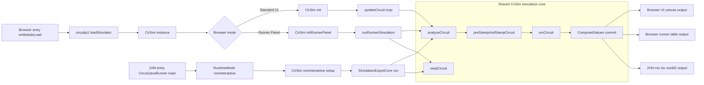

# Circuit Java Runner & Testing Reference

## Purpose

This is a quick operational reference for running CircuitJS1 simulations mostly on the JVM (no browser/GWT UI) and validating behavior with automated tests.

There is also a browser-based runner mode (for example: `circuitjs.html?runner=1...`, with `nonInteractive=1` also supported).

---

## What exists today

- CLI entry point: `com.lushprojects.circuitjs1.client.CircuitJavaRunner`
- Gradle task: `runCircuitJava` (preferred)
- Browser runner mode: `circuitjs.html?runner=1...`
- End-to-end tests:
  - `CircuitJavaRunnerE2ETest`
  - `CircuitJavaSimTestBase` (base class for JVM simulation tests)

---

## Browser Startup Modes Architecture

```mermaid
flowchart TD
    A[onModuleLoad] --> B[loadLocale]
    B --> C[loadSimulator localizationMap]
    C --> D[Create CirSim instance]
    D --> E{runner query param}

    E -- No --> U1[Standard UI Mode init]
    U1 --> U2[UI setup and resize handlers]
    U2 --> U3[updateCircuit loop]

    E -- Yes --> R1[Runner Panel Mode initRunnerPanel]
    R1 --> R2[NonInteractive runtime setup]
    R2 --> R3[Resolve cct ctz startCircuit storage key]
    R3 --> R4[Load and read circuit]
    R4 --> R5[runRunnerSimulation]

    subgraph S[Intersection: Shared Simulation Core]
      S1[analyzeCircuit]
      S2[preStampAndStampCircuit]
      S3[runCircuit solver]
      S4[ComputedValues and circuit state]
    end

    U3 --> S1
    R5 --> S1
    S1 --> S2 --> S3 --> S4

    S4 --> U4[Canvas/UI rendering output]
    S4 --> R6[Runner export/table output]
  ```

## Class-Level Subsystem Touchpoints

```mermaid
flowchart LR
    C1[circuitjs1 EntryPoint] --> C2[loadSimulator]
    C2 --> C3[CirSim]

    C3 --> M{Mode}

    M -- Standard UI --> U1[CirSim init]
    U1 --> U2[UI and Canvas subsystem]
    U1 --> U3[Menu and Options subsystem]
    U1 --> U4[Resize and Event handlers]
    U4 --> U5[updateCircuit scheduler]

    M -- Runner Panel --> R1[CirSim initRunnerPanel]
    R1 --> R2[RuntimeMode and nonInteractive flags]
    R1 --> R3[RunnerLaunchDecision]
    R1 --> R4[Circuit load pipeline]
    R4 --> R5[runRunnerSimulation]
    R5 --> R6[SimulationExportCore]
    R6 --> R7[Runner output rendering]

    subgraph X[Shared CirSim Core touched by both modes]
      X1[readCircuit]
      X2[analyzeCircuit]
      X3[preStampAndStampCircuit]
      X4[runCircuit]
      X5[ComputedValues]
    end

    U5 --> X2
    R5 --> X2
    R4 --> X1
    X2 --> X3 --> X4 --> X5
    X5 --> U2
    X5 --> R7
```

## Unified Architecture Including JVM Runner


    
## Quick commands

### Run with defaults

```bash
./gradlew runCircuitJava
```

Defaults from `build.gradle`:
- circuit: `tests/sfcr-sim-model.txt`
- output: stdout (when no output file provided)
- steps: `500`
- format: `csv`

### Run with custom circuit and step count

```bash
./gradlew -q runCircuitJava -Pcircuit="tests/sfcr-sim-model.txt" -Psteps=10
```

### Write CSV to a file

```bash
./gradlew -q runCircuitJava \
  -Pcircuit="test/resources/sfcr_debug_reference.md" \
  -Poutput="/tmp/runner.csv" \
  -Psteps=20
```

### Emit World2 formatted table (t, P, POLR, CI, QL, NR only)

```bash
./gradlew -q runCircuitJava \
  -Pcircuit="src/com/lushprojects/circuitjs1/public/circuits/economics/1debug.md" \
  -Poutput="/tmp/world2.tsv" \
  -Psteps=20 \
  -Pformat="world2"
```

### Emit World2 table and HTML Plot report

```bash
./gradlew -q runCircuitJava \
  -Pcircuit="src/com/lushprojects/circuitjs1/public/circuits/economics/1debug.md" \
  -Poutput="/tmp/world2.tsv" \
  -Psteps=1000 \
  -Pformat="world2" \
  -Phtml="/tmp/world2-runner.html"
```

Plotting options in the generated HTML report:
- `stacked` (default): five vertically stacked panels (`P`, `POLR`, `CI`, `QL`, `NR`)
- `single-lhs`: one combined plot with five left-side y-axes

These are selected in the report UI via the **Plot mode** dropdown (not via a CLI flag).

Run metadata is also included in two places:
- Terminal/stderr: `CircuitJavaRunner: circuit parameters used` block (timestep, MNA mode, equation tolerance, lookup mode, convergence threshold, EqnTable Newton Jacobian, Auto-Adjust Timestep, and related runtime settings)
- HTML report: **Circuit Parameters Used** table near the top of the page

### Use project test wrapper

```bash
./dev.sh test
```

---

## Browser runner mode

This mode runs simulation in the browser, without normal simulator UI, and renders:

- **Output Table** tab (time + computed values)
- **Standard Output** tab (diagnostic logs)

Use it from the normal app URL:

```text
http://127.0.0.1:8000/circuitjs.html?runner=1&startCircuit=economics/1debug.md&steps=50

http://127.0.0.1:8000/circuitjs.html?runner=1&startCircuit=economics/1debug.md&steps=1000&format=world2
```

### Supported query parameters

- `runner=1` (required to enable this mode)
- `startCircuit=<path>` (e.g. `economics/1debug.md`)
- `steps=<n>` (default `1000`)
- `cct=<inline circuit text>` (optional alternative)
- `ctz=<compressed circuit text>` (optional alternative)
- `nonInteractiveDumpKey=<localStorage key>` (preferred key name)


### Open current in-memory circuit in this mode

From **File → Open Runner Output Table...**.

This opens a new tab with `runner=1&ctz=...` for the current unsaved circuit state.

---

## CLI contract

`CircuitJavaRunner` arguments:

1. `circuitPath` (required)
2. `outputPath` (optional, blank means stdout)
3. `steps` (optional, default `1000` in direct `main`, `500` via Gradle task default)
4. `format` (optional: `csv` or `world2`, default `csv`)

Direct usage:

```bash
java com.lushprojects.circuitjs1.client.CircuitJavaRunner <circuit.txt> [output.csv] [steps] [format]
```

Recommended in this repo: use `./gradlew runCircuitJava` rather than direct `java`.

---

## Output format

CSV output format:

- Header starts with `t`
- Remaining columns are sorted `ComputedValues` keys
- One row per simulation step
- Values come from converged committed values (`ComputedValues.commitConvergedValues()`)

Example header:

```text
t,G_d,Y,YD
```

World2 format (`format=world2`) output:

- Fixed columns only: `Year`, `Population`, `Pollution Ratio`, `Capital Investment`, `Quality of Life`, `Natural Resources`
- Values are tab-separated
- Number formatting follows `war/world2.html` table display conventions

---

## Testing workflow

### Targeted runner E2E tests first

```bash
./gradlew :test --tests "*CircuitJavaRunnerE2ETest*"
```

### Targeted base fixture consumers (if needed)

```bash
./gradlew :test --tests "*SFCRSIMModelTest*" --tests "*LookupTextImportTest*"
```

### Full JVM test suite

```bash
./gradlew test
```

### Optional smoke loop over text circuits

```bash
for f in tests/*.txt; do
  if ./gradlew -q runCircuitJava -Pcircuit="$f" -Psteps=1 >/tmp/runner.out 2>/tmp/runner.err; then
    echo "PASS $f"
  else
    echo "FAIL $f"
  fi
done
```

---

## Recommended regression checklist

When changing solver/runtime/economic model behavior:

1. Run `CircuitJavaRunnerE2ETest`
2. Run one or more `runCircuitJava` commands against representative circuits
3. Inspect CSV for monotonic time and expected key values
4. Run full `./gradlew test`

---

## Common failure signals

- `CircuitJavaRunner: no circuit elements available after load`
  - Circuit file did not parse into elements.
- `CircuitJavaRunner: circuit matrix is null after analyze`
  - No solvable electrical network formed.
- `CircuitJavaRunner: simulation stopped during analyze: ...`
  - Analyze phase raised a stop condition.
- `CircuitJavaRunner: time did not advance at step ...`
  - Simulation did not advance time; inspect stop conditions and circuit validity.

Browser mode (`Standard Output` tab):

- `Runner load failed for all candidates of startCircuit=...`
  - The `startCircuit` path could not be resolved.
- `loadFileFromURLRunner HTTP failure: ... status=...`
  - URL returned non-2xx response.
- `loadFileFromURLRunner timeout after 15s: ...`
  - Circuit file request stalled.
- `window.onerror: ...` or `GWT uncaught exception: ...`
  - Runtime exception occurred during load/simulation.

---

## Notes

- JVM runner mode is enabled by `RuntimeMode.setNonInteractiveRuntime(true)`.
- Tests that touch `ComputedValues` should isolate/reset shared state (`@ResourceLock("ComputedValues")`, `ComputedValues.resetForTesting()`).
- For iterative debugging, prefer small `-Psteps` values first (e.g. `1`, `5`, `10`) and scale up after sanity checks.
